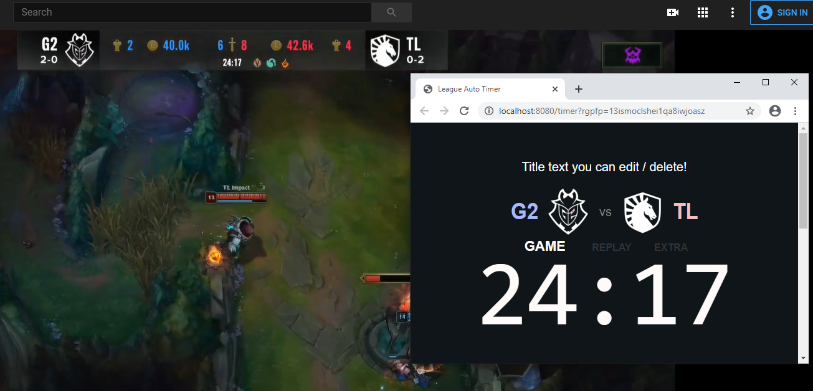
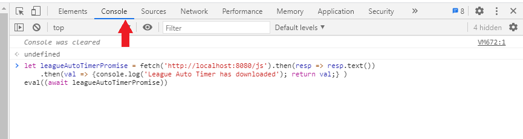
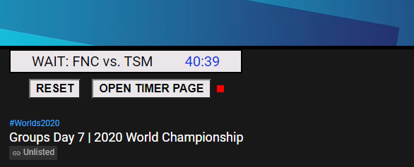

# League Worlds 2020 Automatic Timer

Browser script to auto track timers/data from the LoL 2020 Worlds UI



## Instructions: AUTO mode
1) Open a window in Incognito mode. (Not required, but recommended)

2) Open a 2020 Worlds Livestream or a VOD on Youtube or Twitch. Set quality to 1080p if possible.  
	i.e [Worlds Day 4 Youtube](https://www.youtube.com/watch?v=yrbdT8JWpgc) OR [Worlds Day 4 Twitch](https://www.twitch.tv/videos/762126944)

3) Chrome:  `Ctrl+Shift+I` 	or 	`Menu -> More Tools -> Developer Tools.`  
Firefox:    `Ctrl+Shift+K` 	or 	`Tools -> Web Developer -> Web Console.`

	Then make sure you're on the `Console` tab.


4) Copy & Paste the following code and click ENTER
	```javascript
	let leagueAutoTimerPromise = fetch('https://raw.githubusercontent.com/adrianAnyansi/LeagueAutoTimer/main/AutoTimerScript.js')
	.then(resp => resp.text())
	.then(val => {console.log('League Auto Timer has downloaded'); return val;} )

	eval((await leagueAutoTimerPromise))
	```
	
    The script will start monitoring the video. A small UI will appear over the video title like so:
	

5) Click the `OPEN TIMER` button to open a new window/tab that displays the TIMER. 

	It should connect automatically using WebRTC. The small square next to `OPEN TIMER` will turn BLUE while connecting, (might take up a 1min) then GREEN when the VIDEO & TIMER are linked. 

6) Capture the timer window in OBS and enjoy! Use `RESET` button to refresh the state if there are errors.

## Instructions: MANUAL mode
To use manual mode, use this link: [League Manual Timer](https://league-auto-timer.s3.amazonaws.com/AutoTimerUI.html)

- You can click on either TEAM, or the TIMER to edit and change them.
- Click START TIMER button to start the timer. 

# Known Issues
Script is still being developed, let me know about any new issues at tobe.anyansi@gmail.com

- You might need to refresh the stream/script and reopen the timer. Still debugging webRTC issues.
- The Monitor UI is designed for utility and looks ok in Dark Mode and bad in Light Mode.
- Only tested at 1080p. No guarantee that it will work less than that.
- The timer will take 2-4s to sync sometimes.
	- also, OCRAD mixes up 5 / 3	 4 / 0 / 8 rarely. This will auto fix on later syncs.
- Team names are sometimes missing a letter.
- Only supports group stage teams.

# Current Features
- Tracks ban, game, replay, pause and ads states.
- Tracks the timer and resyncs every 15s.
- Tracks team names and displays logos
- Can tell when pauses occur and pause timer, will keep timer playing during replays.
- Has a manual mode with editable teams and timers.

# Future Features
- Track ban details: i.e Blue side 3rd ban. Not planning to track champions.
- Track game end screen. Display winner/loser
- Allow TIMER/TEAM to be edited while in AUTO mode, for a hybrid AUTO-MANUAL mode.
- Add animations to teams/timer/phases in the TIMER UI.
- Add refresh to the TIMER page
- Allow mouse events to choose team names in TIMER UI.

# FAQ
## How does this work?
In the background, the script is taking screenshots of the video and checking parts of the image for the overlay of the game, ban phase, replay, etc. That info gets passed to the TIMER window by WebRTC, which is a P2P connection directly from your PC to router back to PC. I'm using OCRAD.js for text recognition since its faster than Tesseract for realtime.

## Can this be done on a live-view site? Why not make a new website instead of a script?
**No.**

Once a video is embedded, its locked off from any other script on that website. Without doing some crazy proxying, I can't screenshot the video. So it's run on the YouTube/Twitch website, which acts like the script is from YT/Twitch itself.

Essentially there are 3 options: Run in Console, Use proxies (which YT will not like) or use a Browser extension. This is the easiest one.

## Is it secure?
Yes, all data but one goes directly between browser windows. The script opens a WebSocket under a random password for signalling and closes it after 10s. And if opened in Incognito mode, the script can only access the Youtube video. The code is public so you can see what it does.

## Will you update this for LCS/LEC/LCK/LPL/etc?
Probably not- there's a lot of manual work in determining each phase, i.e I can't use the minimap to track GAME phase since that is removed during PIP/camera work, I need to note the timer location for every timed phase, etc. This differs per broadcast team, and BAN phase differs per region. If I can make the phase discovery more efficient with automation, then perhaps. Likely I'll update this for international tournaments
